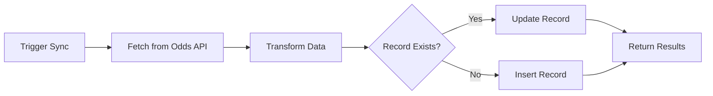

# Odds API Integration - Implementation Summary

## ✅ What Was Created

A complete odds synchronization system that fetches real-time betting data from The Odds API and stores it in your Supabase database.

---

## 📁 Files Created

### 1. **API Route** - `src/app/api/sync-odds/route.ts`
RESTful endpoint for triggering odds synchronization.

**Endpoints:**
- `GET /api/sync-odds` - Trigger sync and get results
- `POST /api/sync-odds` - Alternative trigger method

**Features:**
- ✅ Fetches data from The Odds API
- ✅ Upserts data into `odds_bets` table
- ✅ Returns detailed sync results
- ✅ Error handling and logging
- ✅ Ready for cron job scheduling

**Usage:**
```bash
curl http://localhost:3000/api/sync-odds
```

---

### 2. **Utility Library** - `src/lib/syncOdds.ts`
Reusable async functions for odds synchronization.

**Functions:**

#### `syncOddsToDatabase(sport, apiKey?)`
Syncs odds for a single sport.

```typescript
import { syncOddsToDatabase } from '@/lib/syncOdds';

const result = await syncOddsToDatabase('americanfootball_nfl');
console.log(result.message);
// ✅ Successfully synced all 15 games (10 new, 5 updated)
```

#### `syncMultipleSports(sports[])`
Syncs odds for multiple sports at once.

```typescript
import { syncMultipleSports } from '@/lib/syncOdds';

const results = await syncMultipleSports([
  'americanfootball_nfl',
  'basketball_nba',
  'icehockey_nhl'
]);
```

**Return Type:**
```typescript
{
  success: boolean;
  message: string;
  inserted: number;
  updated: number;
  failed: number;
  errors: string[];
  totalGames: number;
}
```

---

### 3. **UI Component** - `src/components/OddsSyncButton.tsx`
Interactive button to trigger odds sync from your UI.

**Features:**
- ✅ One-click sync trigger
- ✅ Loading state with spinner
- ✅ Success/error feedback
- ✅ Detailed statistics display
- ✅ Error log expansion

**Usage:**
```tsx
import { OddsSyncButton } from '@/components/OddsSyncButton';

export default function Page() {
  return (
    <div>
      <OddsSyncButton />
    </div>
  );
}
```

---

### 4. **Display Component** - `src/components/OddsDisplay.tsx`
Displays synced odds data from the database.

**Features:**
- ✅ Real-time data from Supabase
- ✅ Game listings with teams
- ✅ Spread odds display
- ✅ Bookmaker information
- ✅ Auto-refresh capability
- ✅ Loading and error states

**Usage:**
```tsx
import { OddsDisplay } from '@/components/OddsDisplay';

export default function Page() {
  return (
    <div>
      <OddsDisplay />
    </div>
  );
}
```

---

### 5. **Documentation** - `ODDS_SYNC_GUIDE.md`
Complete user guide with:
- Setup instructions
- Usage examples
- Security best practices
- Scheduling options (Vercel Cron, GitHub Actions)
- SQL query examples
- Troubleshooting tips

---

## 🗄️ Database Schema

### Table: `odds_bets`

```sql
CREATE TABLE odds_bets (
  id UUID PRIMARY KEY DEFAULT gen_random_uuid(),
  api_id TEXT UNIQUE NOT NULL,
  sport_key TEXT NOT NULL,
  sport_title TEXT NOT NULL,
  commence_time TIMESTAMPTZ NOT NULL,
  home_team TEXT NOT NULL,
  away_team TEXT NOT NULL,
  bookmakers JSONB,
  created_at TIMESTAMPTZ DEFAULT NOW(),
  updated_at TIMESTAMPTZ DEFAULT NOW()
);
```

**Indexes:**
- `idx_odds_bets_api_id` - Fast lookups
- `idx_odds_bets_sport_key` - Sport filtering
- `idx_odds_bets_commence_time` - Date queries

**Trigger:**
- Auto-updates `updated_at` on modification

---

## 🔧 Setup Requirements

### Environment Variables

Add to `.env.local`:

```env
# Supabase
NEXT_PUBLIC_SUPABASE_URL=https://your-project.supabase.co
NEXT_PUBLIC_SUPABASE_ANON_KEY=your-anon-key
SUPABASE_SERVICE_ROLE_KEY=your-service-role-key

# The Odds API
ODDS_API_KEY=d38b7f712b4ef276d719082f04a4c89e

# Optional: Secure your endpoint
CRON_SECRET=your-random-secret
```

---

## 🚀 Quick Start

### 1. Manual Sync via Browser
```
http://localhost:3000/api/sync-odds
```

### 2. Manual Sync via Code
```typescript
import { syncOddsToDatabase } from '@/lib/syncOdds';

// In any async function
const result = await syncOddsToDatabase();
```

### 3. Add to Your UI
```tsx
import { OddsSyncButton } from '@/components/OddsSyncButton';
import { OddsDisplay } from '@/components/OddsDisplay';

export default function DashboardPage() {
  return (
    <div className="space-y-8">
      <OddsSyncButton />
      <OddsDisplay />
    </div>
  );
}
```

---

## 📅 Scheduling Options

### Option 1: Vercel Cron (Recommended)

Create `vercel.json`:
```json
{
  "crons": [
    {
      "path": "/api/sync-odds",
      "schedule": "0 */6 * * *"
    }
  ]
}
```

### Option 2: GitHub Actions

Create `.github/workflows/sync-odds.yml`:
```yaml
name: Sync Odds
on:
  schedule:
    - cron: '0 */6 * * *'
jobs:
  sync:
    runs-on: ubuntu-latest
    steps:
      - run: curl https://your-app.vercel.app/api/sync-odds
```

### Option 3: External Cron Services
- [EasyCron](https://www.easycron.com/)
- [cron-job.org](https://cron-job.org/)
- [Uptime Robot](https://uptimerobot.com/) (with monitoring)

---

## 🎯 How It Works



1. **Fetch**: GET request to The Odds API
2. **Transform**: Map API fields to database schema
3. **Check**: Query existing records by `api_id`
4. **Upsert**: Insert new or update existing records
5. **Report**: Return detailed statistics

---

## 📊 Example Queries

### Get upcoming NFL games
```sql
SELECT * FROM odds_bets 
WHERE sport_key = 'americanfootball_nfl' 
AND commence_time > NOW()
ORDER BY commence_time ASC;
```

### Get today's games across all sports
```sql
SELECT * FROM odds_bets 
WHERE commence_time::date = CURRENT_DATE
ORDER BY commence_time;
```

### Extract DraftKings odds
```sql
SELECT 
  home_team,
  away_team,
  bookmakers -> 0 ->> 'title' as bookmaker,
  jsonb_pretty(bookmakers -> 0 -> 'markets') as markets
FROM odds_bets
WHERE bookmakers @> '[{"key": "draftkings"}]'::jsonb;
```

---

## 🔒 Security Best Practices

### 1. Protect Service Role Key
- Never expose `SUPABASE_SERVICE_ROLE_KEY` in client-side code
- Keep in `.env.local` (already gitignored)
- Only use in API routes and server-side functions

### 2. Secure the Sync Endpoint
```typescript
// Add to route.ts
const authHeader = request.headers.get('authorization');
if (authHeader !== `Bearer ${process.env.CRON_SECRET}`) {
  return NextResponse.json({ error: 'Unauthorized' }, { status: 401 });
}
```

### 3. Rate Limiting
Consider adding rate limiting for the endpoint:
```bash
npm install @upstash/ratelimit
```

---

## 🧪 Testing

### Test the API Route
```bash
# Development
curl http://localhost:3000/api/sync-odds

# Production
curl https://your-app.vercel.app/api/sync-odds
```

### Test in Code
```typescript
import { syncOddsToDatabase } from '@/lib/syncOdds';

// Test sync
const result = await syncOddsToDatabase('americanfootball_nfl');
console.log(result);
```

---

## 🐛 Troubleshooting

### "Missing Supabase environment variables"
- Check `.env.local` exists
- Verify all variables are set
- Restart dev server: `npm run dev`

### "API request failed with status 401"
- Invalid Odds API key
- Get new key from [the-odds-api.com](https://the-odds-api.com)

### "No games found from API"
- Check sport key is valid
- Verify API has games for that sport
- Check API rate limit

### Database Errors
- Verify Supabase connection
- Check service role key permissions
- Ensure `odds_bets` table exists

---

## 📈 Monitoring & Limits

### The Odds API Free Tier
- **500 requests/month**
- Each sync = 1 request
- ~16 syncs per day if running every 6 hours
- ~480 syncs per month

### Recommendations
- Sync every 6 hours: `0 */6 * * *`
- Monitor usage in Odds API dashboard
- Upgrade plan if needed ($10/month for 10k requests)

---

## 🎨 Customization Ideas

### 1. Add More Sports
```typescript
const sports = [
  'americanfootball_nfl',
  'basketball_nba',
  'baseball_mlb',
  'icehockey_nhl'
];
await syncMultipleSports(sports);
```

### 2. Filter by Bookmaker
```typescript
// In syncOdds.ts, add markets parameter
const apiUrl = `${baseUrl}&markets=spreads,totals&bookmakers=draftkings,fanduel`;
```

### 3. Add Notifications
```typescript
// Send email/Slack when sync completes
if (result.success && result.inserted > 0) {
  await sendNotification(`New odds: ${result.inserted} games added`);
}
```

### 4. Historical Data
Create a separate table for historical odds tracking:
```sql
CREATE TABLE odds_history AS SELECT * FROM odds_bets;
```

---

## 📚 Additional Resources

- [The Odds API Docs](https://the-odds-api.com/liveapi/guides/v4/)
- [Supabase Docs](https://supabase.com/docs)
- [Next.js API Routes](https://nextjs.org/docs/app/building-your-application/routing/route-handlers)
- [Vercel Cron Jobs](https://vercel.com/docs/cron-jobs)

---

## ✨ Next Steps

1. ✅ Set up environment variables
2. ✅ Test the sync endpoint manually
3. ✅ Add UI components to your dashboard
4. ✅ Set up scheduled syncing
5. ✅ Monitor API usage
6. ✅ Customize for your needs

---

**Happy coding! 🚀**

